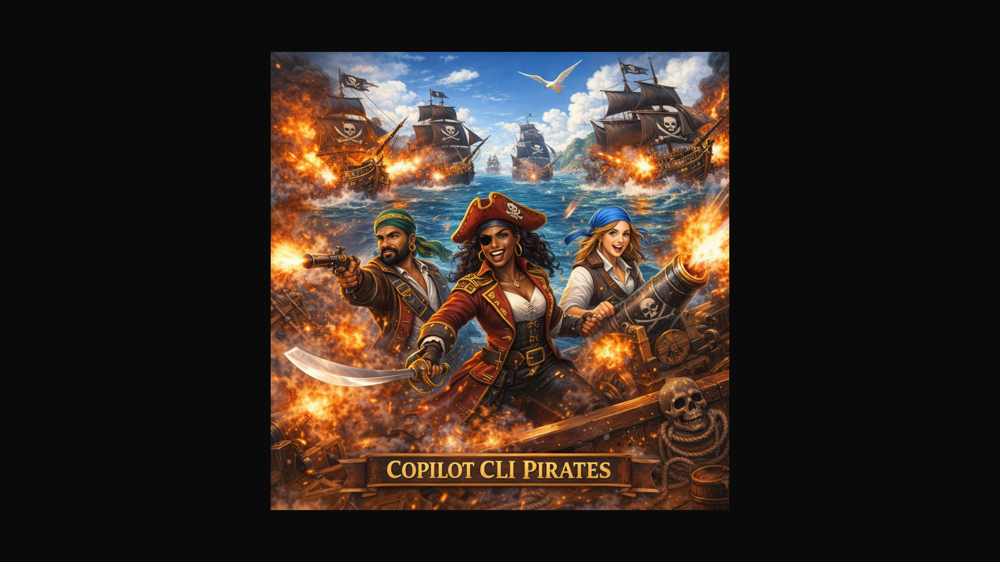
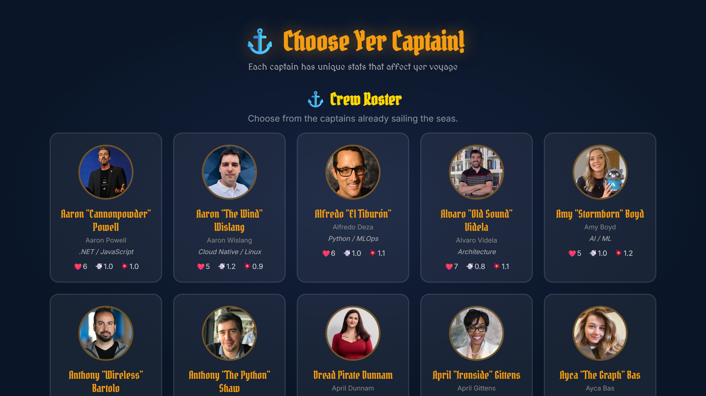

# ⚓ Copilot CLI Pirates

A 3D pirate-themed quiz game built with Three.js where you sail the seas, conquer knowledge islands, and battle enemy ships — all while learning GitHub Copilot CLI commands!



## 🎮 Play Now

👉 **[Play Copilot CLI Pirates](https://softchris.github.io/cli-pirates/)**

## 🌊 Overview

**Copilot CLI Pirates** turns learning into an adventure. Each of the 7 islands represents a lesson from the [GitHub Copilot CLI for Beginners](https://github.com/github/copilot-cli-for-beginners) course. Sail your ship to an island, answer quiz questions to conquer it, and fight pirate ships when you get answers wrong!

### Key Features

- 🏝️ **7 Knowledge Islands** — Each island maps to a lesson from the Copilot CLI course
- ⚔️ **Naval Combat** — Cannon battles with enemy pirate ships using 3D physics
- 🧠 **Quiz System** — 21 questions across 7 lessons with multiple choice answers
- 🚢 **90+ Captains** — Choose from real GitHub/Microsoft Cloud Advocates with unique stats
- 💻 **In-Game Terminal** — Type real Copilot CLI commands that trigger game effects
- 🏆 **27 Badges** — Achievements across 6 categories (combat, exploration, knowledge, etc.)
- 🗺️ **8 Quests** — Complete quests to unlock legendary GitHub mascot captains
- 📊 **Leveling & Skills** — XP system with a skill tree (Navigation, Combat, Knowledge, Leadership)
- 💾 **Auto-Save** — Progress persisted via localStorage
- 🔗 **Social Sharing** — Share your progress on X, LinkedIn, Bluesky, and Reddit
- 🎵 **Dynamic Audio** — Background music, combat sounds, and ambient effects

## 📸 Screenshots

### Captain Selection
Choose from 90+ captains — real Cloud Advocates with pirate names and unique stats.



## 🎮 How to Play

### Controls

| Key | Action |
|-----|--------|
| **W / ↑** | Sail forward |
| **S / ↓** | Sail backward |
| **A / ←** | Turn left |
| **D / →** | Turn right |
| **Space** | Fire cannons |
| **T** | Open terminal |
| **B** | Open badges/quests |
| **ESC** | Pause / Menu |

### Gameplay Loop

1. **Choose your captain** — Each has unique HP, speed, and damage stats
2. **Sail to an island** — Navigate the open seas to find knowledge islands
3. **Answer quiz questions** — Get 3 correct to conquer the island
4. **Fight enemy ships** — Wrong answers spawn aggressive pirate ships
5. **Level up** — Earn XP from combat, quests, and island conquests
6. **Unlock skills** — Spend skill points on Navigation, Combat, Knowledge, or Leadership
7. **Complete quests** — Unlock legendary GitHub mascot captains
8. **Earn badges** — 27 achievements to collect

## 🏝️ The Seven Islands

Each island represents a lesson from the Copilot CLI for Beginners course:

| # | Island | Lesson Topic |
|---|--------|-------------|
| 1 | **Intro Isle** | Introduction to Copilot CLI |
| 2 | **Setup Shore** | Installation & Setup |
| 3 | **Prompt Peninsula** | Prompt Engineering |
| 4 | **Code Cove** | Code Generation |
| 5 | **Debug Bay** | Debugging with Copilot |
| 6 | **Test Reef** | Testing Assistance |
| 7 | **Deploy Depths** | Deployment & CI/CD |

## 💻 In-Game Terminal (27 Commands)

Press **T** to open the terminal. Type real Copilot CLI commands to trigger game effects!

| Command | Real CLI Purpose | Game Effect |
|---------|-----------------|-------------|
| `/help` | Show available commands | List all terminal commands |
| `/model` | Switch AI model | Change ship type (Galleon/Frigate/Sloop) |
| `/context` | Set file context | Reveal nearest island quiz answers |
| `/clear` | Clear terminal | Clear terminal output |
| `/diff` | Show code changes | Intel on nearby enemies |
| `/plan` | Create implementation plan | Show island conquest strategy |
| `/research` | Deep research mode | Discover hidden treasure locations |
| `/version` | Show CLI version | Display game version & stats |
| `/share` | Share session | Copy shareable progress link |
| `/fleet` | — | Summon allied NPC ships |
| `/repair` | — | Repair ship hull |
| `/skills` | — | Open skill tree |
| `/agent` | Delegate to AI agent | Summon ghost ship that auto-hunts enemies |
| `/memory` | Access conversation memory | Random buff from past voyages |
| `/mcp` | Model Context Protocol | "Mystic Cannon Protocol" — triple damage |
| `/init` | Initialize project | Reset all cooldowns + temporary shield |
| `/pr` | Create pull request | Loot magnet — pulls drops toward ship |
| `/issue` | Create GitHub issue | Mark enemy for double damage |
| `/commit` | Commit changes | HP floor lock — can't go below current HP |
| `/status` | Show git status | Full battlefield status report |
| `/review` | Code review | Scan nearest enemy's stats |
| `/delegate` | Delegate task | Auto-heal 2 HP/s for 10s |
| `/test` | Run tests | 360° cannon barrage |
| `/credits` | — | Show game credits |
| `/lore` | — | Show island lore |
| `/sea` | — | Spawn sea creatures |
| `/weather` | — | Change weather effects |

## 🏆 Badges (27 Achievements)

### Categories

- **⚔️ Combat** — Ship battles and destruction milestones
- **🧭 Exploration** — Visiting islands and sailing distances
- **🧠 Knowledge** — Quiz performance and streaks
- **📈 Progression** — Leveling up and skill upgrades
- **💰 Economy** — Gold earning and spending
- **🎯 Miscellaneous** — Special achievements

### Tiers
- 🥉 **Bronze** — Entry-level achievements
- 🥈 **Silver** — Intermediate milestones
- 🥇 **Gold** — Master-level accomplishments

## 🗺️ Quests & Legendary Captains

Complete 8 quests to unlock GitHub mascot captains:

| Quest | Requirement | Unlocks |
|-------|------------|---------|
| Octocat's Trial | Conquer 3 islands | **Mona** 🐙 |
| Rubber Duck Debugging | Answer 10 questions correctly | **Ducky** 🦆 |
| AI Apprentice | Use 8 different CLI commands | **Copilot** 🤖 |
| The Unicorn Path | Reach level 10 | **Monacorn** 🦄 |
| Wave Rider | Visit all 7 islands | **Surftocat** 🏄 |
| Code Warrior | Sink 15 enemy ships | **Scottocat** 🏴 |
| Power Overwhelming | Unlock 5 skills | **Steroidtocat** 💪 |
| Rainbow Journey | Earn 10 badges | **Nyantocat** 🌈 |

## 🚢 Captain System

### 90+ Playable Captains

Captains are real GitHub & Microsoft Cloud Advocates with:
- **Pirate names** (e.g., Aaron "Cannonpowder" Powell)
- **GitHub avatars** from their real profiles
- **Unique stats**: HP (4-8), Speed (0.7-1.3), Damage (0.8-1.2)
- **Specialties** based on their real expertise

### Ship Types (via `/model` command)

| Ship | HP | Speed | Damage |
|------|-----|-------|--------|
| **Galleon** | High | Slow | Medium |
| **Frigate** | Medium | Medium | Medium |
| **Sloop** | Low | Fast | High |

## 📊 Progression System

### XP Sources
- Conquering islands
- Sinking enemy ships
- Answering questions correctly
- Completing quests

### Skill Tree (4 Branches)

- **🧭 Navigation** — Faster sailing, better turning
- **⚔️ Combat** — More damage, faster reload
- **🧠 Knowledge** — Quiz hints, bonus XP
- **👑 Leadership** — Better crew, more gold

## 🛠️ Technical Details

### Built With
- **[Three.js](https://threejs.org/)** — 3D rendering engine
- **[Kenney Pirate Kit](https://kenney.nl/assets/pirate-kit)** — 3D ship and prop models (40 GLB files)
- **Vanilla JavaScript** — No frameworks, pure JS game engine
- **CSS3** — UI overlays, animations, and effects
- **Web Audio API** — Procedural sound effects
- **localStorage** — Save/load game progress

### Architecture
```
cli-pirates/
├── index.html          # Entry point
├── css/style.css       # All UI styles
├── js/
│   ├── game.js         # Main game engine (~4000 lines)
│   └── questions.js    # Quiz questions from 7 lessons
├── models/             # 40 GLB 3D models (Kenney Pirate Kit)
├── images/
│   └── splash.png      # Splash screen artwork
├── audio/              # Background music & sound effects
└── screenshots/        # Playwright-captured screenshots
```

### Game Engine Features
- Procedural ocean with animated waves
- Dynamic weather system (clear, storm, fog)
- Particle effects (explosions, splashes, treasure sparkles)
- Enemy AI with aggro system and patrol routes
- Collision detection for ships, islands, and cannonballs
- Day/night cycle
- Mini-map with real-time tracking

## 🚀 Running Locally

1. Clone the repository:
   ```bash
   git clone https://github.com/softchris/cli-pirates.git
   cd cli-pirates
   ```

2. Serve with any HTTP server:
   ```bash
   python -m http.server 8080
   # or
   npx serve .
   ```

3. Open `http://localhost:8080` in your browser

## 📝 Credits

- **3D Assets**: [Kenney Pirate Kit](https://kenney.nl/assets/pirate-kit) (CC0 License)
- **Quiz Content**: [GitHub Copilot CLI for Beginners](https://github.com/github/copilot-cli-for-beginners)
- **Captain Avatars**: GitHub profile photos of real Cloud Advocates
- **Built with**: [Three.js](https://threejs.org/), vanilla JavaScript

## 📄 License

MIT License — see [LICENSE](LICENSE) for details.

---

*Set sail, answer questions, conquer islands, and master the Copilot CLI! ⚓🏴‍☠️*
